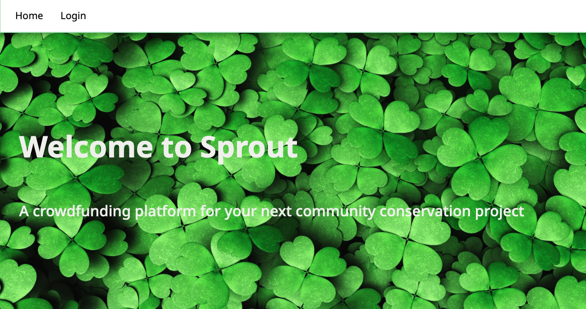
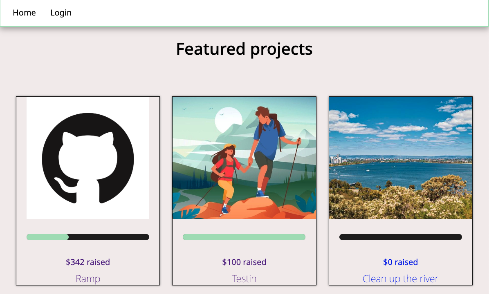
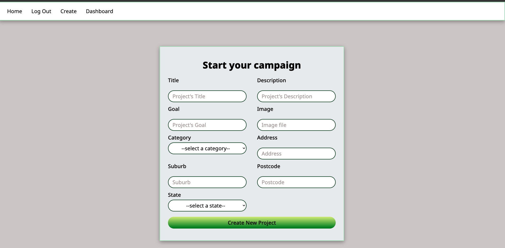
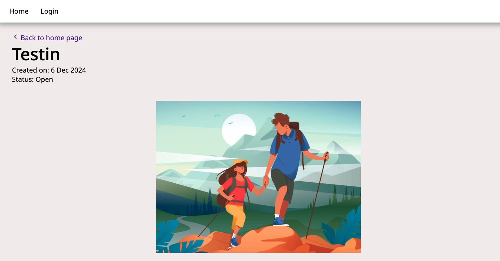
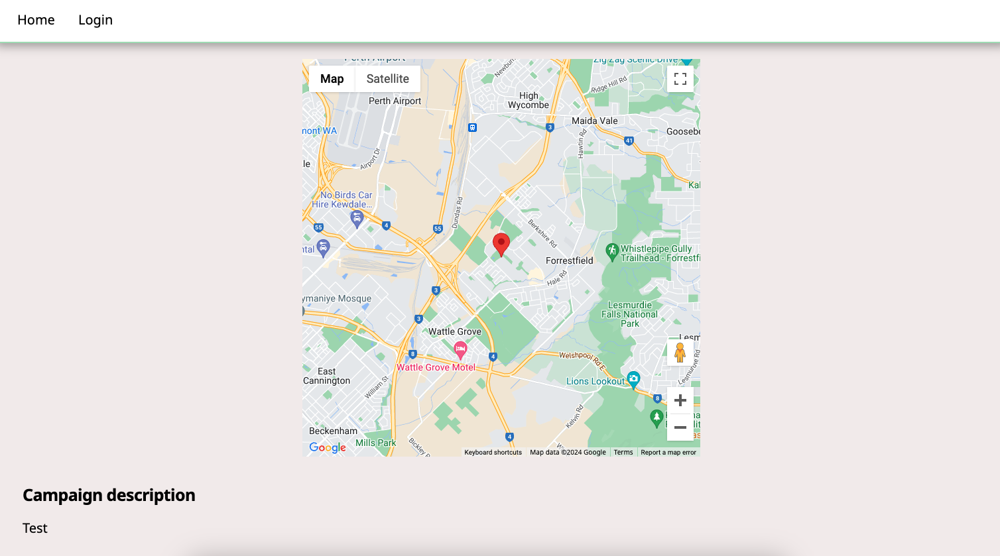
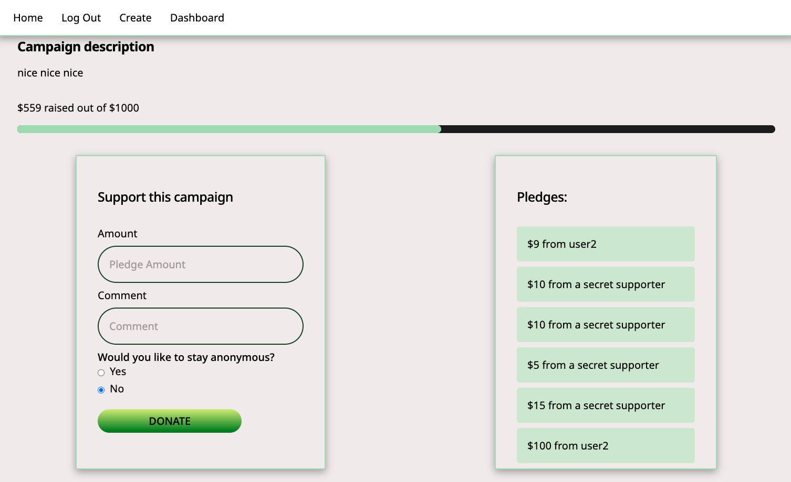
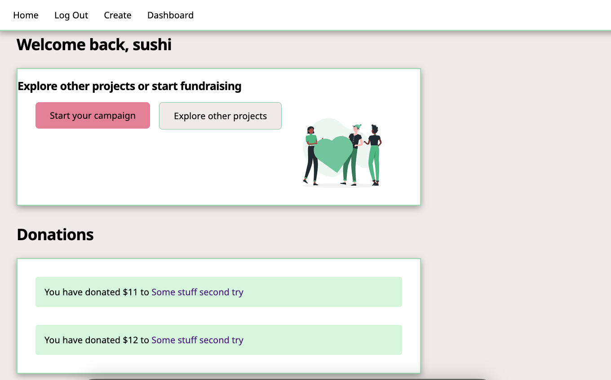
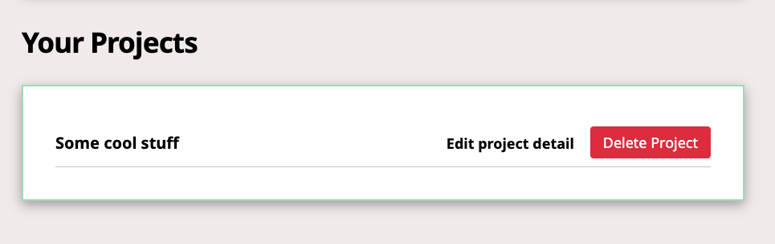

# Crowdfunding Front End

**Amber Nguyen**

- Deployed Site: https://ambon-sprout.netlify.app/
- Backend Repo: https://github.com/ambo-n/crowdfunding_back_end

## Concept/Name

Sprout is a community-focused crowdfunding platform dedicated to supporting conservation and outdoor recreation projects. Whether developing new parks, restoring rivers and wildlife habitats, or creating outdoor spaces that inspire future generations, Sprout empowers communities and public land managers to bring their visions to life. By connecting passionate individuals with meaningful environmental projects, we help ensure a greener, more accessible outdoors for everyone.

### Intended Audience/User Stories

Sprout is intended for people who share a vested interest in preserving natural spaces and enhancing outdoor recreation for current and future generations.

### Front End Pages/Functionality

- A page on the front end
  - Home page where all the featured projects can be found ('/')
  - Projects page ('/projects')
  - Project detail page ('/project/:id')
  - Dashboard where user's activities are recorded ('/dashboard')
  - Signup page('/users')
  - Login page('/login')
  - Create Project page('/projects')

### Screenshots

Two screenshots of the homepage:

A screenshot of the project creation page:

Screenshots of a project page example with pledges:

Screenshots of the user dashboard where the logged in user has access to update and delete their projects and see donations they have made:

