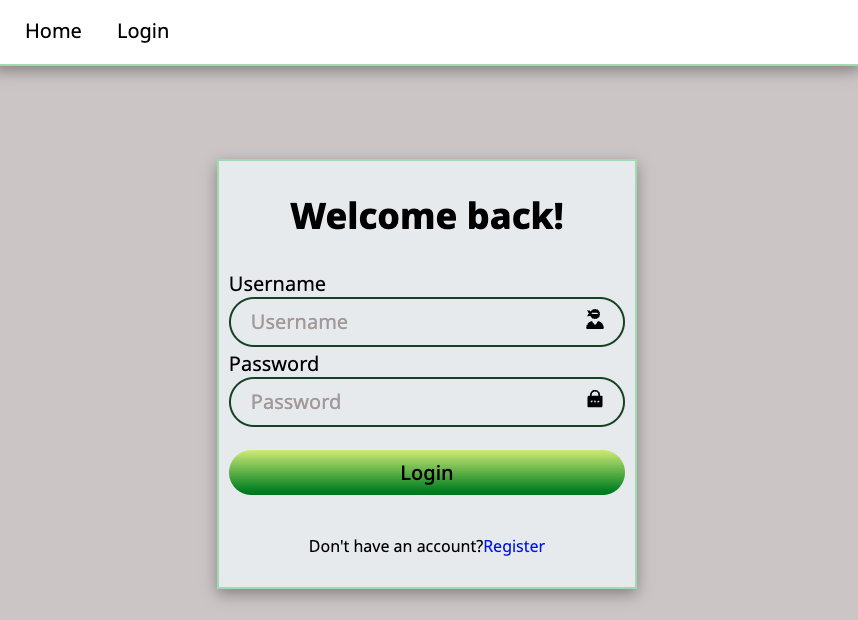
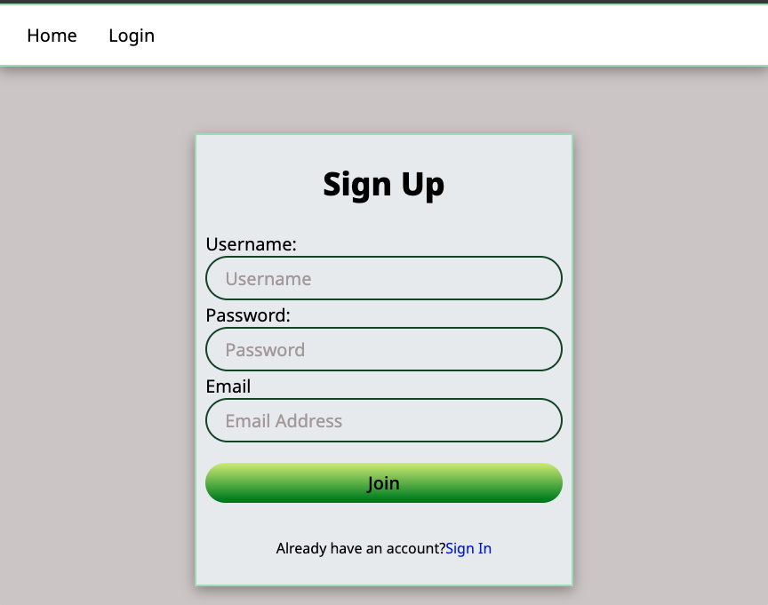

# Crowdfunding Front End - Welcome to Sprout

**Amber Nguyen**

- Deployed Site: https://ambon-sprout.netlify.app/
- Backend Repo: https://github.com/ambo-n/crowdfunding_back_end

Sprout is a full-stack crowdfunding platform built with a Python/Django backend and a JavaScript/React frontend.

## Features:

Within this application, users can:

- Sign up and log in.
- Create, update, and delete their own campaigns.
- Make pledges to existing projects.
- View all existing projects.

## Key Details:

- The project model integrates with the Google Maps API to retrieve longitude and latitude coordinates when users enter an address for their fundraising campaign.
- Suitable user permissions are implemented to ensure actions performed within the application are secure and appropriately restricted.

## Concept/Name

Sprout is a community-focused crowdfunding platform dedicated to supporting conservation and outdoor recreation projects. Whether developing new parks, restoring rivers and wildlife habitats, or creating outdoor spaces that inspire future generations, Sprout empowers communities and public land managers to bring their visions to life. By connecting passionate individuals with meaningful environmental projects, we help ensure a greener, more accessible outdoors for everyone.

### Intended Audience/User Stories

Sprout is intended for people who share a vested interest in preserving natural spaces and enhancing outdoor recreation for current and future generations.

### Front End Pages/Functionality

- Paths
  - Home page where all the featured projects can be found ('/')
  - Projects page ('/projects')
  - Project detail page ('/project/:id')
  - Dashboard where user's activities are recorded ('/dashboard')
  - Signup page('/users')
  - Login page('/login')
  - Create Project page('/projects')

### Screenshots

- Home Page Features:
  - Users can view the featured projects and explore them individually
  - User can log in to gain further access to other features within the platform
- Two screenshots of the homepage:
  
  

- Login Page/ Signup Features:
  - The user can log in if they have an existing account
  - Or they can sign up
- Screenshots of the log in/sign up pages
  
  

- Project Creation Page:
  - Once logged in, the user can now have access to the project creation tab
  - User can create their own campaign by filling out the fields in the form
- A screenshot of the project creation page:
  

- Individual project Page:

  - Each project page contains:
    - A campaign image
    - A Google Map showing the location where the campaign is raising funds
    - A campaign description
    - A progress bar displaying how much money has been raised
    - A pledge form for making contributions - which is enabled only after the user logs in
    - A list of past pledges made to the campaign

- Screenshots of a project page example with pledges:
  
  
  

- Dashboard Page:
  - The Dashboard Page is only available when the user is logged in.
  - Each Dashboard Page contains:
    - Greetings
    - A list of past pledges made by the user
    - A list of projects made by the user including the options where they can edit the project's details or delete it.
- Screenshots of the user dashboard where the logged in user has access to update and delete their projects and see donations they have made:

